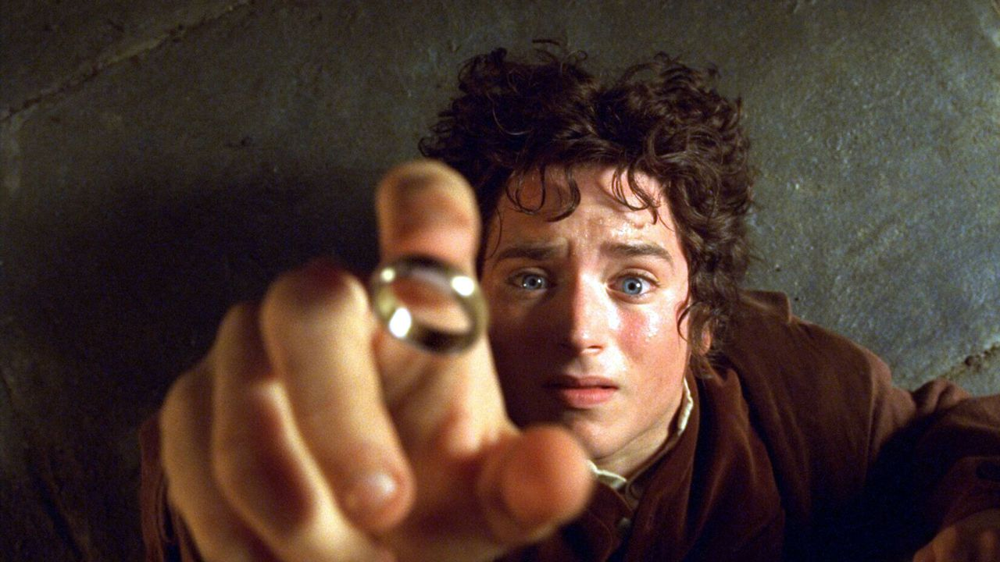

# Le Seigneur des Anneaux - Guide Complet

Bienvenue dans le guide complet du Seigneur des Anneaux, l'œuvre littéraire emblématique de J.R.R. Tolkien. Dans ce guide, nous plongerons profondément dans l'univers fantastique, les personnages mémorables et les thèmes épiques de ce chef-d'œuvre.

## Table des Matières

1. [Introduction](#introduction)
2. [Les Terres de la Terre du Milieu](#les-terres-de-la-terre-du-milieu)
   - [La Comté](#la-comté)
   - [La Terre du Mordor](#la-terre-du-mordor)
   - [La Lorien](#la-lorien)
   - [Isengard](#isengard)
3. [Les Personnages Principaux](#les-personnages-principaux)
   - [Frodon Sacquet](#frodon-sacquet---hobbit)
   - [Aragorn](#aragorn---humain)
   - [Legolas](#legolas---elfe)
   - [Gimli](#gimli---nain)
   - [Gandalf le Gris](#gandalf-le-gris---istari)
4. [L'Anneau Unique](#lanneau-unique)
   - [Code : Création de l'Anneau](#code--création-de-lanneau)
5. [L'Aventure Épique](#laventure-épique)
   - [Code : Voyage de la Communauté de l'Anneau](#code--voyage-de-la-communauté-de-lanneau)
6. [Conclusion](#conclusion)

## Introduction

Le Seigneur des Anneaux est une trilogie de romans de haute fantaisie composée de "La Communauté de l'Anneau", "Les Deux Tours" et "Le Retour du Roi". Il s'agit d'une histoire épique qui se déroule dans un monde imaginaire rempli d'intrigues, de quêtes héroïques et de créatures fantastiques.



## Les Terres de la Terre du Milieu

### $${\color{red}La-Franche-Comté}$$

La Comté est la paisible maison des Hobbits, un lieu de verdure, de confort et de tranquillité. Voici un tableau illustrant la vie paisible des Hobbits :

| Lieu      | Description                          |
| --------- | ------------------------------------ |
| Maison    | Petites maisons en forme de terriers |
| Campagne  | Champs de blé, jardins et rivières   |
| Brasserie | Bières savoureuses et conviviales    |

### $${\color{red}Poudlard}$$

La Terre du Mordor est l'antithèse de la Comté, un lieu de ténèbres et de danger. Voici un tableau décrivant le territoire sinistre du Mordor :

| Lieu       | Description                              |
| ---------- | ---------------------------------------- |
| Montagne   | Montagnes infranchissables               |
| Volcan     | Mont Doom, où l'Anneau doit être détruit |
| Forteresse | Barad-dûr, le repaire de Sauron          |

### $${\color{red}La-Forêt-Interdite}$$

La Lorien est une forêt enchantée et le foyer de la Dame Galadriel. Voici un tableau illustrant la beauté de ce lieu :

| Lieu      | Description                                     |
| --------- | ----------------------------------------------- |
| Canopée   | Arbres immenses aux feuilles dorées             |
| Fleuves   | Rivières argentées qui traversent la forêt      |
| Galadhrim | Les Elfes de la Lorien, protecteurs de la forêt |

### $${\color{red}La-tour-Eiffel}$$

Isengard est la citadelle de Saroumane, le sorcier corrompu. Voici un tableau décrivant la sinistre forteresse :

| Lieu         | Description                                       |
| ------------ | ------------------------------------------------- |
| Tour Orthanc | Tour noire et menaçante au centre de la citadelle |
| Uruk-hai     | Créatures monstrueuses créées par Saroumane       |

## Les Personnages Principaux

### Frodon Sacquet - Hobbit

Frodon est le protagoniste principal de l'histoire, chargé de la mission héroïque de détruire l'Anneau Unique pour sauver la Terre du Milieu. Voici un extrait du code décrivant Frodon :

```python
class Hobbit:
    def __init__(self, nom, courage):
        self.nom = nom
        self.courage = courage

frodon = Hobbit("Frodon Sacquet", 10)
```

### Aragorn - Humain

```python
class Humain:
    def __init__(self, nom, race, compétences):
        self.nom = nom
        self.race = race
        self.compétences = compétences

aragorn = Humain("Aragorn", "Humain", ["Épéiste redoutable", "Leader charismatique"])
```

### Legolas - Elfe

```python
class Elfe:
    def __init__(self, nom, race, compétences):
        self.nom = nom
        self.race = race
        self.compétences = compétences

legolas = Elfe("Legolas", "Elfe", ["Archer extraordinaire", "Agile"])
```

### Gimli - Nain

```python
class Nain:
    def __init__(self, nom, race, traits):
        self.nom = nom
        self.race = race
        self.traits = traits

gimli = Nain("Gimli", "Nain", ["Fort", "Résistant", "Habile avec une hache"])
```

### Gandalf le Gris - Istari

```python

```
